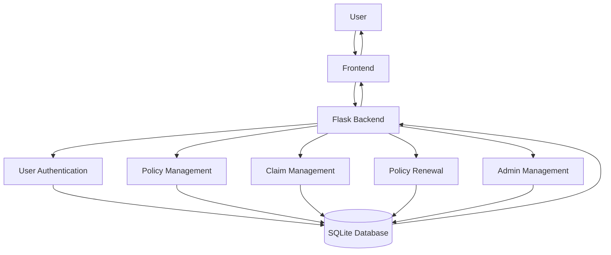

```mermaid
flowchart TD

    A[User] --> B[Frontend]

    B --> C[Flask Backend]

    C --> D[User Authentication]
    C --> E[Policy Management]
    C --> F[Claim Management]
    C --> G[Policy Renewal]
    C --> H[Admin Management]

    D --> I[(SQLite Database)]
    E --> I
    F --> I
    G --> I
    H --> I

    I --> C
    C --> B
    B --> A
```