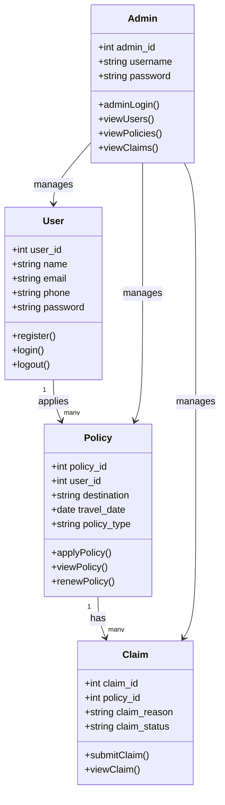

```mermaid
classDiagram

    class User {
        +int user_id
        +string name
        +string email
        +string phone
        +string password
        +register()
        +login()
        +logout()
    }

    class Policy {
        +int policy_id
        +int user_id
        +string destination
        +date travel_date
        +string policy_type
        +applyPolicy()
        +viewPolicy()
        +renewPolicy()
    }

    class Claim {
        +int claim_id
        +int policy_id
        +string claim_reason
        +string claim_status
        +submitClaim()
        +viewClaim()
    }

    class Admin {
        +int admin_id
        +string username
        +string password
        +adminLogin()
        +viewUsers()
        +viewPolicies()
        +viewClaims()
    }

    User "1" --> "many" Policy : applies
    Policy "1" --> "many" Claim : has
    Admin --> User : manages
    Admin --> Policy : manages
    Admin --> Claim : manages
```