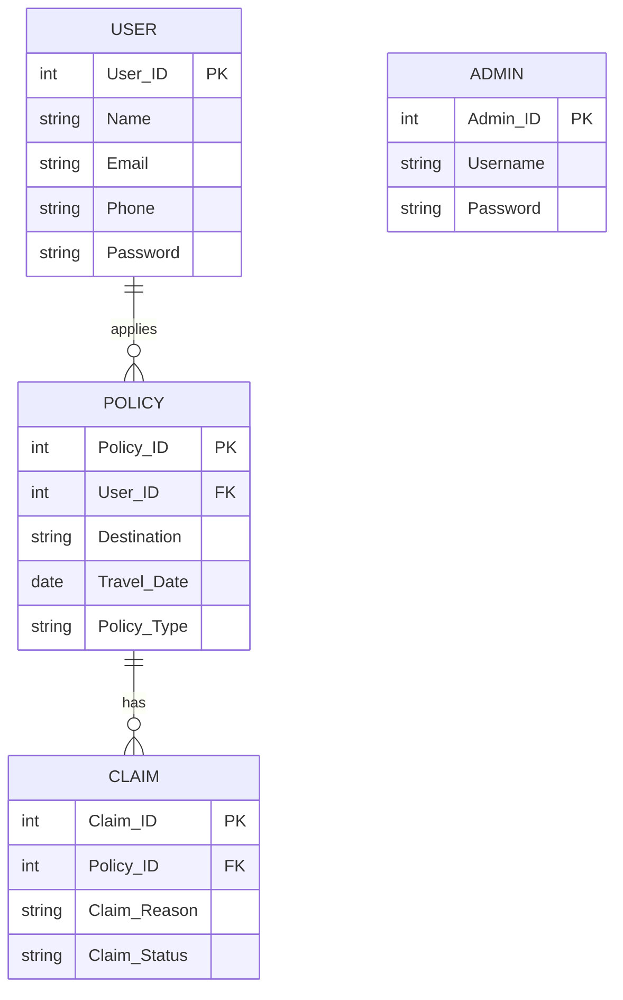

```mermaid
erDiagram

    USER ||--o{ POLICY : applies
    POLICY ||--o{ CLAIM : has

    USER {
        int User_ID PK
        string Name
        string Email
        string Phone
        string Password
    }

    POLICY {
        int Policy_ID PK
        int User_ID FK
        string Destination
        date Travel_Date
        string Policy_Type
    }

    CLAIM {
        int Claim_ID PK
        int Policy_ID FK
        string Claim_Reason
        string Claim_Status
    }

    ADMIN {
        int Admin_ID PK
        string Username
        string Password
    }
```